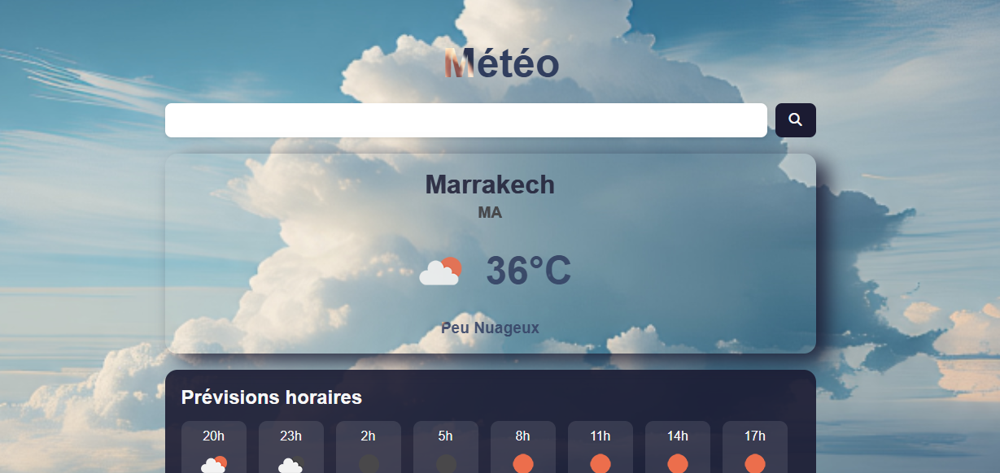
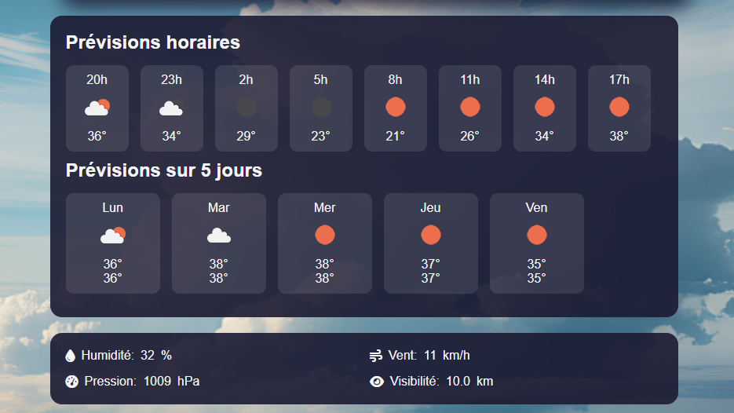

 
# Application Météo avec API

Une application météo responsive qui affiche les conditions actuelles, les prévisions horaires et les prévisions sur 5 jours pour n'importe quelle ville dans le monde.

## Fonctionnalités

- Affichage de la météo actuelle (température, conditions, humidité, vitesse du vent)
- Prévisions horaires pour les 24 prochaines heures
- Prévisions sur 5 jours
- Météo basée sur la localisation (géolocalisation)
- Basculer entre degrés Celsius et Fahrenheit
- Design responsive pour tous les appareils

## Technologies Utilisées

- HTML5
- CSS3 (avec animations)
- JavaScript (ES6)
- API OpenWeatherMap

## Installation

1. Clonez ce dépôt
2. Ouvrez `index.html` dans votre navigateur
3. Entrez le nom d'une ville pour voir la météo

## Clé API

Note : Cette application utilise une clé API gratuite d'OpenWeatherMap. Pour une utilisation en production, veuillez obtenir votre propre clé API sur [OpenWeatherMap](https://openweathermap.org/) et la remplacer dans `script.js`.

## Captures d'écran

  
  

## Licence

Ce projet est open source et disponible sous licence MIT.